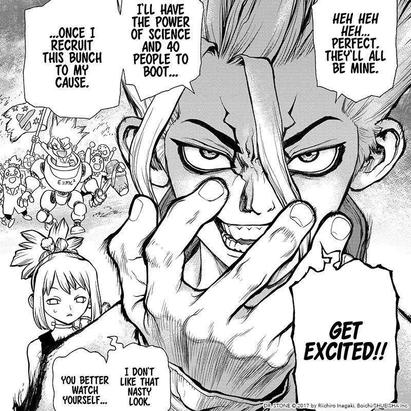

# Introduction
Good Rassa or good soup is a personal project for me, Akshay Shinde `s.\("\(String("akshay".reversed()))")@gmail.com`

The idea for the MVP is to create an iOS app that can help document recipies, learn Japanese and learn iOS development.

The Japanese bit might be confusing. In a distant uncertain future, the idea of this app is to represent any task as a recipe and organize pre-requisites, sub-tasks as some form of ingredients, sub-recipies and so on.

In an even more distant and even more uncertain future. I want to add some automation where a recipe is initiated by some automated trigger and which in turn triggers some other step in a recipe that creates a good soup (rassa) 😅 `"Rassa" = Marathi("Soup")`

Another goal is to document the anime Dr Stone and add all the recipes to restart civilaization in the good rassa app in case humanity has to restart the civilation after being turned into stone for thousands of years.

  

